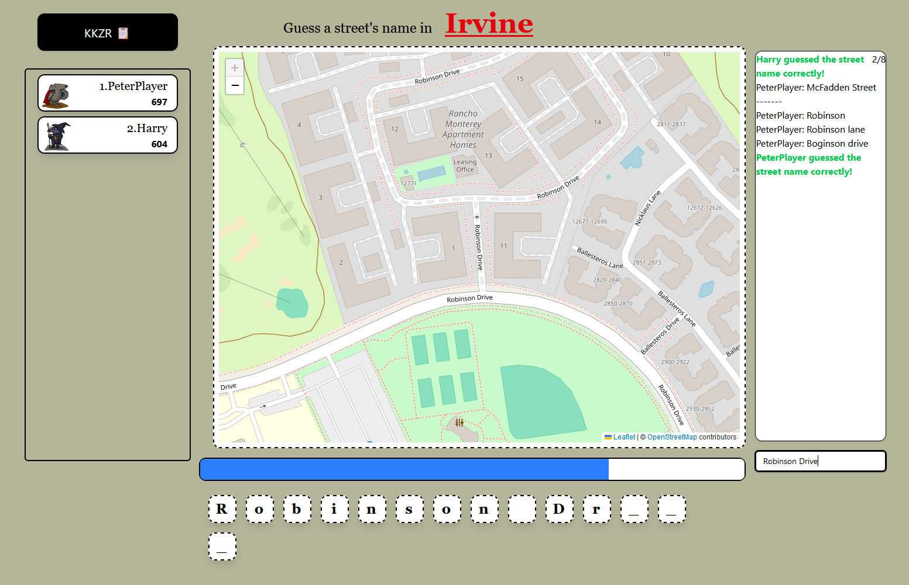
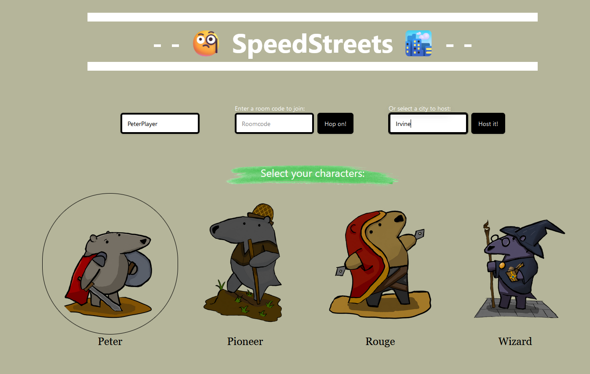
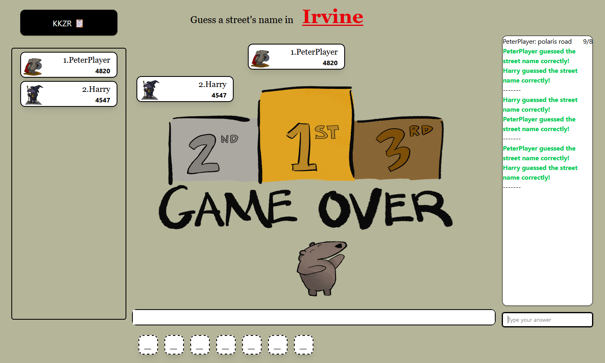

# SpeedStreets

Our project for IrvineHacks 2025: a multiplayer geography game that tests how well you know the streets in your city!



## How to Run

Development frontend:
```sh
cd ./frontend/
npm install
npm run dev
```
- Typically will be on `localhost:5173`

Development backend:
```sh
cd ./backend/
npm install
node index.js
```

## How to Play

Just open up the game's homepage, enter a city name, choose a name, and click "Host it!" A new game will be created.

Give the room code to your participants, who can also enter it on the homepage to join!

You can also choose a different character, including:
- Peter
- Pioneer
- Rouge
- Wizard (our mascot!)

Each character has a different buff or debuff--hover over them to find out.

## Screenshots





## Technologies

Frontend:
- Vite and React
- Tailwind CSS
- Leaflet, including data from OpenStreetMap using the Stadia.StamenWatercolor provider

Backend:
- Node.js
- Express
- Socket
- The OpenStreetMap/Overpass API

## Credits

Thanks to OpenStreetMap for providing the map data

Art by @JiaZhu350

Backend and API work by @Big-Dyl

Frontend styling by @edokydocy

Socket communication, map, and merge conflict resolution by @Cadecraft
